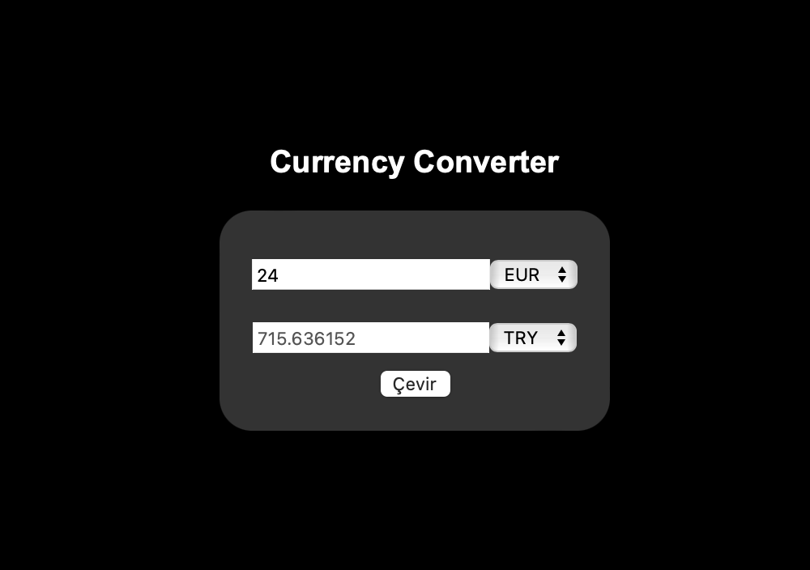

- [Introduction](#introduction)
- [How to run this project](#how-to-run-this-project)
- [Galery](#galery)


# Introduction

It is a currency converter project. You can add or subtract the currency unit you want. Exchange rate data in the project was taken from exchangeratesapi.io

# How to run this project

```bash
npm run dev
# or
yarn dev
# or
pnpm dev
```

Open [http://localhost:3000](http://localhost:3000) with your browser to see the result.

You must add API Key to page.js in 16.line.

# Galery

